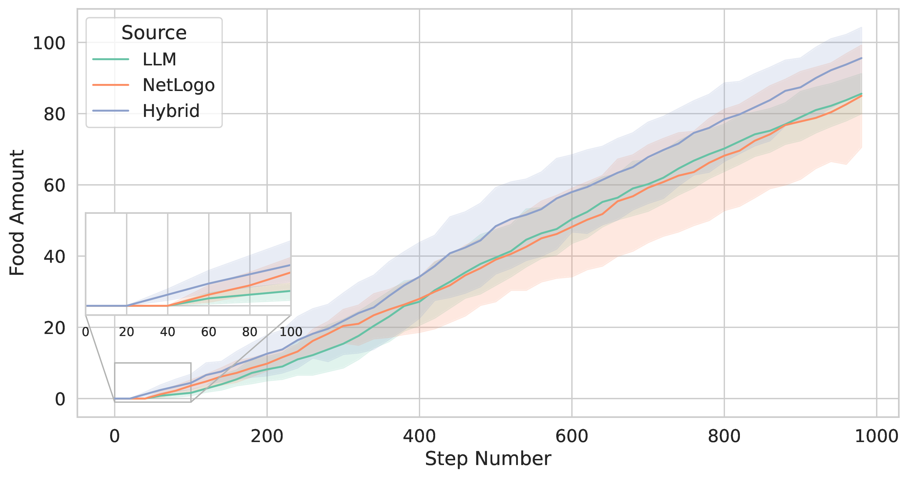

# Code Repository for the paper: Multi-Agent Systems Powered by Large Language Models: Applications in Swarm Intelligence

Source code of the ant colony and flocking simulations with OpenAI GPT4o and NetLogo

## Description

This work explores the integration of large language models (LLMs) into multi-agent simulations by replacing traditional hard-coded agent programs with LLM-driven prompts. It focuses on two examples from swarm intelligence: ant colony foraging and bird flocking. A key component of this study is a toolchain that connects LLMs with the NetLogo simulation platform, using its Python extension to communicate with GPT-4 via the OpenAI API. This setup allows for prompt-driven behavior generation, enabling agents to adapt to environmental data. The research employs both structured, rule-based prompts and autonomous, knowledge-driven prompts. Ultimately, it demonstrates how this toolchain can help LLMs investigate self-organizing processes and generate emergent behaviors in multi-agent environments, offering new methods for studying intelligent systems and modeling swarm intelligence inspired by nature.

Below are figures from the manuscript that illustrate the total amount of food collected in the ant simulation, as well as the flocking distance observed in the bird simulations.

<table>
  <tr>
    <td>
       
      Ant foraging simulation in NetLogo.
    </td>
    <td>
       
      Comparison of the total food collected across the three tested models.
    </td>
  </tr>
</table>

<table>
  <tr>
    <td>
       
      Bird flocking simulation in NetLogo.
    </td>
    <td>
       
      Flocking distance of the birds.
    </td>
  </tr>
</table>

## Simulations 
Access to OpenAI's ChatGPT GPT4o model is required. 
1. The ants simulation files are in the `ants` folder. There are two NetLogo scripts: `AntColony_Hybrid_LLM_Rulebased.nlogo` runs the hybrid model (LLM + NetLogo), whereas the `AntColony_LLM_Only.nlogo` runs the purely LLM-controlled model.
2. The flocking simulations are in the `birds` folder. The NetLogo script `bird_flocking_hybrid_llm_rulebased.nlogo` runs the hybrid model.

The pure NetLogo models are already included in the main NetLogo program. The `.txt` in the folders show the prompt evolution and fine-tuning during the simulations.

## Plotting 
The folders `ants` and `birds` contain Python scripts for plotting and the results as csv files. To reproduce the plots from the manuscript:
1. Ant colony simulation results: Execute `ants/data/ants_food_collection.py`
2. Bird flocing simulation results: Execute: `birds/data/flocking.py`
